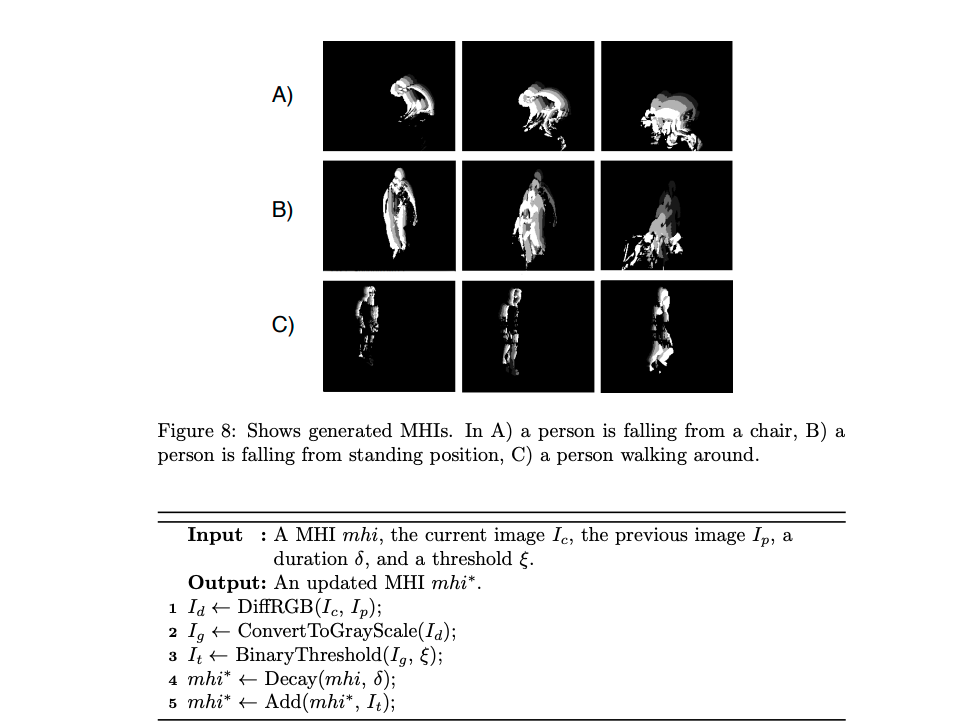

# Fall-Detection

## Introduction

 The elderly is a fastest growing age group today.  Falls among elderly is one of a major concern. A system to detect a fall early would help decreasing the following damage on elderly.
 
 This project utilize **GluonCV YOLOv3 Object Detector** model to detect the person and uses the Fall Detection model to identify fall and not-fall situation.

 The Fall Detection model for this project based on the paper [Real-time Vision-based Fall Detection with Motion History Images and Convolutional Neural Networks](http://www.diva-portal.org/smash/get/diva2:1254131/FULLTEXT01.pdf) by T. HARALDSSON. We use Motion History Images (MHIs) algorithm to generate inputs for the model.



 The model use Convolutional Network with pretrained [MobileNetV2](https://arxiv.org/abs/1801.04381) with [PyTorch](https://pytorch.org/) framework.

The [Fall Detecton Dataset FDD] (http://le2i.cnrs.fr/Fall-detection-Dataset)is used for training the model


## Instruction
1. To use GluonCV YOLOv3 Object Detector, you need to subscribe to the [service](https://aws.amazon.com/marketplace/pp/prodview-5jlvp43tsn3ny)
2. Create Notebook Instance in Amazon Sagemaker and put 'https://github.com/nithiroj/Fall-Detection' in Git repository option.
3. Open `fall-detection.ipynb` using Sagemaker Notebook Instance and execute cell by cell.

## For DEMO
You can run demo on your local computer. Please download `demo.py`, vdo and its correspondant json file from the folder `vdo` and `result` into same location and run

```python
python demo.py --fname coffee_room_52
```